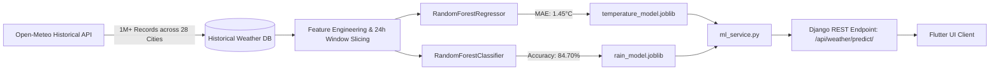

<div align="center">

# 🌦️ WeatherWise
### *Next-Generation AI Weather Intelligence & Climate Forecasting*

[](https://flutter.dev)
[](https://dart.dev)
[](https://www.djangoproject.com/)
[](https://www.django-rest-framework.org/)
[](https://scikit-learn.org/)
[](https://python.org)

<p align="center">
  <b>A sleek, cross-platform mobile application powered by deep Machine Learning to deliver climate-resilient weather forecasts, real-time AQI tracking, celestial astronomy, and hyper-personalized daily lifestyle advice.</b>
</p>

[Key Features](#-key-features) • [ML Architecture](#-machine-learning-engine) • [API Reference](#-api-endpoints) • [Quickstart](#-quickstart-guide) • [Deployment](#-cloud-deployment) • [Contributing](#-contributing)

---

</div>

## 🌟 Overview

**WeatherWise** bridges the gap between conventional forecasts and predictive intelligence. Rather than simply regurgitating third-party APIs, WeatherWise pairs real-time atmospheric telemetry with an in-house **Random Forest Machine Learning pipeline** trained on over **1,000,000+ historical data points** spanning 28 diverse climate zones.

Whether you're dodging sudden Himalayan precipitation, preparing for desert heatwaves in Rajasthan, or monitoring coastal humidity along the Arabian Sea, WeatherWise delivers accurate, actionable insights right to your pocket.

---

## ✨ Key Features

<table>
  <tr>
    <td width="50%">
      <h3>🤖 AI-Powered 24-Hour Forecast</h3>
      <ul>
        <li><b>Temperature Regression:</b> Predicts 24-hour average temperatures with an ultra-low <b>1.45°C MAE</b>.</li>
        <li><b>Rain Classification:</b> Evaluates barometric pressure, dew point, and cloud cover to classify rain likelihood with <b>84.70% accuracy</b>.</li>
        <li><b>Offline / Resilient Fallback:</b> Graceful heuristic engine ensures the app never crashes even under intermittent connectivity.</li>
      </ul>
    </td>
    <td width="50%">
      <h3>📍 Geolocation & Reverse Geocoding</h3>
      <ul>
        <li><b>Instant Location Detection:</b> Automatically asks for device permissions and fetches local coordinates.</li>
        <li><b>Reverse Geocoding:</b> Converts GPS latitude & longitude into city, state, and country names in real time.</li>
        <li><b>Global Search:</b> Look up current and forecast weather for any global city in milliseconds.</li>
      </ul>
    </td>
  </tr>
  <tr>
    <td width="50%">
      <h3>🌫️ Real-Time Air Quality (AQI)</h3>
      <ul>
        <li><b>Comprehensive Telemetry:</b> Tracks PM2.5, PM10, Nitrogen Dioxide (NO₂), Ozone (O₃), and Sulphur Dioxide (SO₂).</li>
        <li><b>European AQI Standard:</b> Color-coded visual badges indicating Good, Fair, Moderate, Poor, and Very Poor air states.</li>
      </ul>
    </td>
    <td width="50%">
      <h3>💡 Smart Lifestyle Advice Engine</h3>
      <ul>
        <li><b>Persona-Based Insights:</b> Generates customized recommendations for commuters, athletes, gardeners, and allergy-sensitive individuals.</li>
        <li><b>Preventative Alerts:</b> Real-time warnings for extreme UV index, heat exhaustion, and sudden downpours.</li>
      </ul>
    </td>
  </tr>
  <tr>
    <td width="50%">
      <h3>🌅 Solar & Lunar Astronomy</h3>
      <ul>
        <li><b>Precision Sun Times:</b> Exact golden hour, sunrise, dawn, dusk, and sunset computed via the <code>astral</code> engine.</li>
        <li><b>Moon Phase Tracker:</b> Real-time lunar phase calculation (New Moon, Waxing Crescent, Full Moon, etc.).</li>
      </ul>
    </td>
    <td width="50%">
      <h3>🎨 Premium UI / UX</h3>
      <ul>
        <li><b>Adaptive Themes:</b> Smooth transitions between Dark Mode and Light Mode.</li>
        <li><b>Micro-Animations:</b> Liquid pull-to-refresh, animated weather cards, and interactive metrics.</li>
        <li><b>Glassmorphism:</b> Modern frosted cards with sleek typography.</li>
      </ul>
    </td>
  </tr>
</table>

---

## 🧠 Machine Learning Engine

The predictive backbone of WeatherWise is trained on **1,013,304 historical weather records** covering 28 Indian cities representing 7 distinct climate zones:
- **Himalayan / Hill**: Shimla, Srinagar, Gangtok
- **Desert / Arid**: Jodhpur, Bikaner, Jaipur
- **Western Coast**: Mumbai, Goa, Mangalore
- **Eastern Coast**: Kolkata, Bhubaneswar, Visakhapatnam
- **Northeast**: Guwahati, Shillong, Imphal
- **Deccan / Central**: Hyderabad, Nagpur, Bhopal, Pune
- **Indo-Gangetic & South**: Delhi, Lucknow, Patna, Kanpur, Chennai, Bangalore, Kochi, Coimbatore, Madurai



### Model Performance Metrics

| Model | Algorithm | Target Output | Benchmark Metric | Compressed Size |
| :--- | :--- | :--- | :--- | :--- |
| **Temperature** | `RandomForestRegressor` (100 estimators, depth 15) | 24h Average Temperature (°C) | **MAE: 1.45°C** | **86 MB** |
| **Precipitation** | `RandomForestClassifier` (100 estimators, depth 15) | Will Rain in Next 24h (T/F + Prob) | **Accuracy: 84.70%** | **41 MB** |

---

## 🏗️ System Architecture

```text
┌─────────────────────────────────────────────────────────────┐
│                    Flutter Client (Mobile)                  │
│   Riverpod State • Dynamic Theming • Geolocation Service    │
└──────────────────────────────┬──────────────────────────────┘
                               │ HTTPS / JSON
                               ▼
┌─────────────────────────────────────────────────────────────┐
│             Django REST Backend (Gunicorn + WSGI)           │
│  WhiteNoise Static • CORS Headers • Environment Config      │
├──────────────────────────────┬──────────────────────────────┤
│ Services:                    │ ML Inference:                │
│  • services.py (Open-Meteo)  │  • ml_service.py             │
│  • advice_service.py         │  • temperature_model.joblib  │
│  • reverse_geocode           │  • rain_model.joblib         │
└──────────────────────────────┴──────────────────────────────┘
```

---

## 📡 API Endpoints

All backend endpoints are prefixed with `/api/weather/`:

| Method | Endpoint | Query Parameters | Description |
| :--- | :--- | :--- | :--- |
| `GET` | `/search/` | `?city=<name>` | Searches coordinates and country for a given city query. |
| `GET` | `/current/` | `?lat=<lat>&lon=<lon>` | Returns current weather parameters, condition codes, and hourly trends. |
| `GET` | `/forecast/` | `?lat=<lat>&lon=<lon>` | 7-day daily temperature highs/lows and weather condition summaries. |
| `GET` | `/reverse-geocode/` | `?lat=<lat>&lon=<lon>` | Converts GPS coordinates into a human-readable city and state. |
| `GET` | `/aqi/` | `?lat=<lat>&lon=<lon>&city=<name>` | Returns European AQI index, PM2.5, PM10, NO₂, and ozone metrics. |
| `GET` | `/astronomy/` | `?lat=<lat>&lon=<lon>` | Computes exact sunrise, sunset, dawn, dusk, and moon phases. |
| `GET` | `/predict/` | `?lat=<lat>&lon=<lon>` | Runs ML inference on current atmospheric conditions for a 24h forecast. |
| `GET` | `/advice/` | `?lat=<lat>&lon=<lon>&profiles=<list>` | Generates targeted weather warnings and lifestyle tips. |

---

## 🚀 Quickstart Guide

### Prerequisites
- **Flutter SDK** (`>= 3.19.0`)
- **Python** (`3.10` or `3.11`)
- **Git**

### 1. Clone the Repository
```bash
git clone https://github.com/Anshul-3107/WeatherWise.git
cd WeatherWise
```

### 2. Backend Setup
```bash
cd backend

# Create and activate virtual environment
python -m venv venv

# Windows:
.\venv\Scripts\Activate.ps1
# macOS/Linux:
source venv/bin/activate

# Install dependencies
pip install -r requirements.txt

# Run migrations
python manage.py migrate

# Start Django development server
python manage.py runserver
```
*The API is now running at `http://127.0.0.1:8000/`.*

### 3. Frontend Setup
In a new terminal window at the project root:
```bash
# Get dependencies
flutter pub get

# Run on connected device or emulator
flutter run
```

---

## ☁️ Cloud Deployment

The backend is pre-configured with **Gunicorn**, **WhiteNoise**, and a standard `Procfile` / `render.yaml` for immediate deployment to **Render**, **Railway**, or **Fly.io**.

### 1-Click Deployment on Render
1. Create a free account on [Render](https://render.com).
2. Click **New +** ➔ **Web Service** and connect your `WeatherWise` repository.
3. Configure the service:
   - **Root Directory:** `backend`
   - **Build Command:** `pip install -r requirements.txt && python manage.py collectstatic --noinput`
   - **Start Command:** `gunicorn weatherwise_backend.wsgi:application`
4. Set Environment Variables:
   - `DEBUG`: `False`
   - `ALLOWED_HOSTS`: `*`
   - `SECRET_KEY`: *(generate a secure random string)*
5. Click **Deploy Web Service**.

### Connecting the Flutter App to Production
To point your Flutter app to your deployed backend, supply `API_BASE_URL` when compiling:
```bash
flutter run --dart-define=API_BASE_URL=https://<your-render-subdomain>.onrender.com/api/weather
```
Or build the production Android APK:
```bash
flutter build apk --release --dart-define=API_BASE_URL=https://<your-render-subdomain>.onrender.com/api/weather
```

---

## 📂 Project Structure

```text
WeatherWise/
├── backend/                         # Django REST Backend
│   ├── weather/                     # Core weather application
│   │   ├── management/commands/     # CLI commands (collect_data, train_models)
│   │   ├── ml_models/               # Serialized ML models (.joblib)
│   │   ├── advice_service.py        # Lifestyle recommendations logic
│   │   ├── ml_service.py            # Model loader & ML inference pipeline
│   │   ├── services.py              # Open-Meteo & reverse geocoding integrations
│   │   ├── views.py                 # REST API view endpoints
│   │   └── urls.py                  # API routing
│   ├── weatherwise_backend/         # Django project settings & WSGI/ASGI
│   ├── Procfile                     # Deployment process definition
│   ├── render.yaml                  # Render Infrastructure-as-Code blueprint
│   ├── requirements.txt             # Python package dependencies
│   └── manage.py
├── lib/                             # Flutter Cross-Platform Client
│   ├── core/                        # Theme, constants, design tokens
│   ├── models/                      # Dart JSON data models
│   ├── screens/                     # UI Views (Home, Search, Settings, etc.)
│   ├── services/                    # HTTP networking & geolocation services
│   └── main.dart                    # Application entry point
├── assets/                          # App branding and icon assets
├── pubspec.yaml                     # Flutter package dependencies
└── README.md
```

---

## 🤝 Contributing

Contributions make the open-source community an incredible place to learn, inspire, and create. Any contributions you make are **greatly appreciated**!

1. Fork the Project
2. Create your Feature Branch (`git checkout -b feature/AmazingFeature`)
3. Commit your Changes (`git commit -m 'Add some AmazingFeature'`)
4. Push to the Branch (`git push origin feature/AmazingFeature`)
5. Open a Pull Request

---

## 👨‍💻 Author

**Anshul Arohi**  
*Full-Stack & Mobile Developer*  
[](https://github.com/Anshul-3107)

---

<div align="center">
  <b>⭐ If you like this project, please give it a star on GitHub! ⭐</b>
</div>
